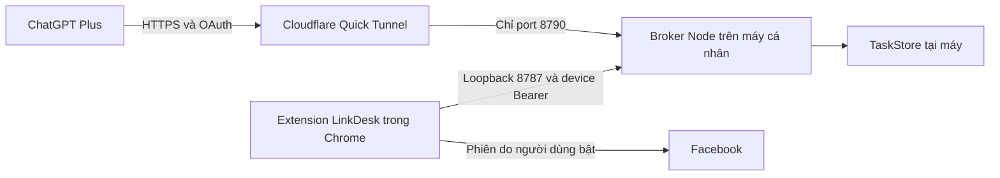

# Link kết nối đang chạy ở đâu?

## Cấu hình hiện tại: máy cá nhân và Quick Tunnel

LinkDesk 0.2.0 chạy broker Node trên máy của người dùng. `npm run connect` khởi động cloudflared và broker, tạo HTTPS endpoint tạm để ChatGPT gọi MCP. Đây là kết nối thử nghiệm; chưa triển khai backend lên Cloudflare Workers hoặc một máy chủ cloud chạy độc lập.

Port 8765 là preview UI/docs, không phải endpoint MCP. Port 8787 là device API loopback cho extension, không đưa qua tunnel. Port 8790 là OAuth/MCP; metadata và đăng ký OAuth công khai theo giao thức, tools yêu cầu access token. Nhãn HTTPS của tunnel không có nghĩa toàn bộ code chạy trên cloud.

Theo [Cloudflare Quick Tunnels](https://developers.cloudflare.com/tunnel/get-started/quick-tunnels/), URL tạm ngừng hoạt động khi cloudflared dừng; hostname đổi khi tạo tunnel mới và dịch vụ không có uptime guarantee. Giữ máy, broker và tunnel chạy để thử nghiệm ChatGPT. Không bật xác thực email tương tác trước endpoint MCP vì sẽ cản client.

Owner code hiện lưu bền vững ở owner-code.txt và dùng lại khi restart; startup lỗi không ghi đè mã của broker đang chạy. OAuth client/session/token vẫn trong memory, access token tối đa 24 giờ, không có refresh. Restart broker cần kết nối lại. Dữ liệu task nằm trong `.linkdesk-data`; trạng thái campaign/job nằm trong extension Chrome. GitHub và ZIP chỉ chứa source/docs, không chứa credentials hay task người dùng.

## Hai bước triển khai sau trong M6 / L060

1. **Hostname cố định:** dùng named Cloudflare Tunnel với tài khoản/domain do chủ dự án cung cấp. Broker vẫn ở máy cá nhân; máy tắt thì tác vụ ngừng. Bổ sung launcher và lưu/revoke OAuth bền vững. Chỉ route OAuth/MCP, giữ device API loopback.
2. **Backend chạy trên cloud:** cần host tương thích Node, storage bền vững, OAuth/revoke/retention/lock và một thiết kế ghép Chrome từ xa. Extension hiện chỉ nhận device API `127.0.0.1:8787`; không chỉ thay URL để trỏ lên cloud. Nếu chọn Workers, phải port handler và TaskStore sang runtime/storage phù hợp rồi kiểm thử lại. Không công khai device token hoặc tắt xác thực để làm kết nối chạy.

Hai phương án đều cần phiên ChatGPT thực sự xử lý queue. Đưa backend lên cloud không tự tạo AI daemon từ gói Plus, và thao tác Facebook vẫn phụ thuộc Chrome đang hoạt động.

## Nghiệm thu trước production

OAuth thật và bốn tools; analyze/compose về Chrome; exact-link invariants; reconnect/revoke/restart; một tiến trình sở hữu TaskStore; cap/STOP và trạng thái uncertain; secrets không vào Git/package. Chưa đóng M6 hoặc gọi production chỉ vì HTTPS metadata trả 200.
