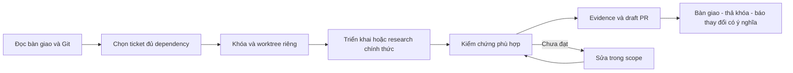

# Vòng lặp phát triển LinkDesk

09/10/2026. Vòng lặp build trong task Codex, không phải lịch đăng Facebook.

Đề xuất heartbeat mỗi 6 giờ, tối đa một ticket Ready mỗi lượt. Máy/app/ngân sách phải sẵn sàng; không hứa 24/7. Scheduler dùng automation Codex, không cài cron/service ngầm. AI worker và publisher có ngân sách/quyền độc lập.

Đã tạo heartbeat ACTIVE ngày09/10/2026 trong task hiện tại, ID `ph-t-tri-n-linkdesk-theo-super-plan`, chu kỳ6 giờ. Đây là cấu hình scheduler đã xác nhận; chưa phải bằng chứng một chu kỳ build đã hoàn tất. Không tạo bản trùng khi tiếp tục; cập nhật automation hiện có nếu owner yêu cầu đổi lịch.

## Một lượt

1. Xác nhận repo/HEAD/status/ownership. Docs chưa vào main thì đọc nhánh `codex/affiliate-super-plan` và ghi dependency PR. Không switch/reset/stash checkout đang được dùng.
2. Chọn ưu tiên theo plan.json và gate. Dirty files hoặc khóa cowork → worktree/file độc lập. Gate live không đóng bằng mock.
3. Tìm đúng file bằng rg, viết acceptance trước sửa, nhận khóa theo COWORK_PROTOCOL; contract khác vùng cần phối hợp owner.
4. Link/auth/lease/backup cần regression; UI cần QA; docs cần JSON/links/status consistency. Chỉ broaden checks khi có thay đổi/failure/rủi ro mới.
5. Ghi evidence trong PR, coordinator cập nhật docs-status để không tranh ghi bảng chung.
6. Push branch và mở draft PR nếu thay đổi hoàn chỉnh; không force-push, merge, deploy public, cấp quyền account hoặc gửi bình luận thật tự động.
7. Chỉ thông báo khi có deliverable, failure mới hoặc cần owner; giữ yên lặng nếu không có thay đổi có ý nghĩa.

## Dừng và chuyển việc

Sai repo, khóa không nhận được, đổi ngoài scope, quyền nền tảng chưa rõ, checkpoint, publishing uncertain hoặc ngân sách hết → dừng việc phụ thuộc, lưu bước tiếp theo; có thể làm ticket độc lập được phép. Không vượt auth/browser policy, đọc cookie/password/token hay retry uncertain. Không tăng ngân sách worker, restart broker OAuth memory hoặc tạo tunnel/plugin trùng.

Thứ tự G0 AI/recovery/lease → G1 discovery/bản thảo → G2 live → G3 vận hành → G4 account/report → G5 nền tảng. Research đi trước publisher được, nhưng không mở quyền runtime.

## Theo dõi và bàn giao

Đo ticket qua gate, regressions, task trùng, resume sau reload, candidate false-positive, evidence publish và uncertain. Chỉ đặt KPI sau baseline đủ mẫu; không tối ưu số bình luận/click suy đoán.

Bàn giao ticket/base/head/branch/files/PR/checks/evidence đã bỏ private data/gate/rollback/next step. Chưa xong không gọi done. API/chính sách đổi thì cập nhật PLATFORM_RESEARCH và khóa capability liên quan đến khi xác minh lại.
