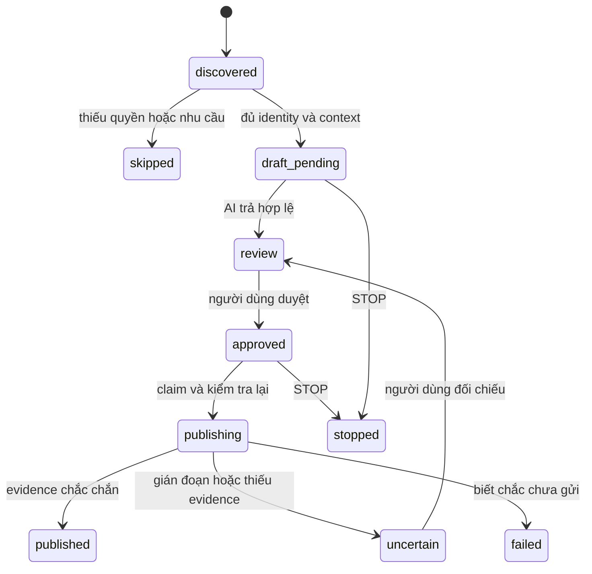

# Discovery theo nguồn — đặc tả cần triển khai

09/10/2026 · L071–L075 · Planned; adapter hiện có chưa chứng minh đặc tả này đã hoạt động.

## Nguồn chọn một lần

Nhóm cho phép quảng cáo, Page sở hữu hoặc nguồn khác có quyền phù hợp được lưu thành SourceScope. Hệ thống tìm bài, tạo candidate và permalink; không bắt người dùng dán URL từng bài. Home feed có bài ngoài scope thì chỉ gợi ý nguồn để kiểm tra. Bài demo/lập trình chứa “AI” không đủ bằng chứng nhu cầu mua.

## Hợp đồng dữ liệu đề xuất

| Entity | Trường tối thiểu | Quy tắc |
|---|---|---|
| AccountRef | id, platform, displayName, ownerConfirmed, capabilities, credentialRef | credentialRef trỏ private storage, không backup token |
| SourceScope | id, accountId, platformSourceId, kind, allowedActions, rulesEvidence, confirmedAt, expiresAt | read/draft/publish riêng; hết hạn trở về review |
| DiscoverySession | id, campaignVersion, accountId, scopeIds, limits, cursor, state | Resume không mở rộng quyền/cấp lại budget |
| Candidate | id, platformPostId, permalink, scopeId, contextExcerpt, observedAt, decision, reasons | Không có stable identity thì không publish |
| DraftJob | taskId, candidateId, rawUrlSnapshot, accountId, approvalVersion, status | App gắn URL, AI không tạo URL |
| Evidence | jobId, type, publishedId/permalink, observedAt, source | Không có evidence thì uncertain |

Đề xuất retention excerpt 7 ngày, candidate bỏ qua 30 ngày; có nút xóa và không xóa lịch sử đang đối soát. Chỉ lưu ngữ cảnh đủ giải thích, không gom hồ sơ/thành viên/thông tin nhạy cảm. Schema này là thiết kế, chưa migration vào model.

Dedupe key: platform/account/post/campaign; thêm khóa platform/post/campaign phát hiện trùng liên account. Mặc định không dùng account khác để quảng cáo lại cùng bài. Sửa campaign không đổi snapshot job cũ.

## Pipeline

Chi tiết lớp từ khóa/alias/ngữ cảnh và routing campaign ở [KEYWORD_DISCOVERY](KEYWORD_DISCOVERY.md), cùng profile và acceptance examples trong `docs/examples/`. Danh sách gồm AI, Claude, Codex, Antigravity, Gemini, Grok, Cursor/Cussor, ChatGPT, API và các entity mở rộng. Match chỉ tìm candidate; không tự cấp quyền publish.

1. Kiểm tra account/scope còn hiệu lực, không suy quyền từ tên nhóm hoặc AI.
2. Đọc cửa sổ giới hạn bằng adapter được phép. Đề xuất 20 bài/10 phút/5 drafts mỗi lượt; đây là giới hạn sản phẩm, không phải quota Facebook.
3. Match từ khóa/alias theo ranh giới Unicode, kiểm tra nghĩa AI và loại trùng, quá cũ, đóng bình luận, thiếu identity/permalink, ngoài scope; hiển thị reason code. Generic ai/API hoặc Cursor CSS không tự khớp chủ đề.
4. Đánh giá nhu cầu: hỏi nơi mua/công cụ/tài nguyên liên quan mới vào draft. Demo không hỏi gợi ý → skip; ngữ cảnh thiếu → review.
5. AI trả decision/reasonCodes/evidence và nội dung không URL. Score chỉ để xếp hạng, không cấp quyền.
6. App validate schema/length, gắn raw snapshot URL + disclosure rồi preview.
7. Chỉ gửi mục/phiên approved theo capability; kiểm tra lại account/post/context/rules/approval và STOP ngay trước side effect.

Reason codes: OUT_OF_SCOPE, NO_BUYING_INTENT, DUPLICATE, IDENTITY_MISSING, RULES_EXPIRED, CONTEXT_CHANGED, ACCOUNT_MISMATCH, REVIEW_REQUIRED. Test có bài hỏi mua và demo để đo false-positive; ghi số mẫu, không tự tuyên bố accuracy100%.

STOP sau side effect phải ghi kết quả đã quan sát hoặc uncertain, không giả thao tác được hoàn tác. Lease task AI khác claim publishing. Restore/reload không tự approved.

## UI và gate

Tab Discovery có nguồn lưu sẵn, hạn mức, Bắt đầu lượt đọc, STOP, candidate/bản thảo và lý do bỏ qua. Hàng đợi giữ task ID; failed/completed/cancel phải mở khóa nút. Đổi account vô hiệu approval cũ. Permission unknown/adapter experimental hiển thị rõ.

Browser login không chứng minh quyền tự thu thập/gửi. Xác minh truy cập được phép trước reader; không private endpoint reverse-engineering, vô hạn scroll, auto join nhóm chưa chọn. Layout đổi dừng trước side effect. Không đủ quyền thì gợi ý/bản thảo và thao tác owner.

G1 dùng fixture rồi một lượt đọc giới hạn nếu có quyền. G2 riêng: một candidate approved, cap1, đúng URL/account/post, STOP, uncertain không retry. Development heartbeat không gửi bình luận thật để test.
