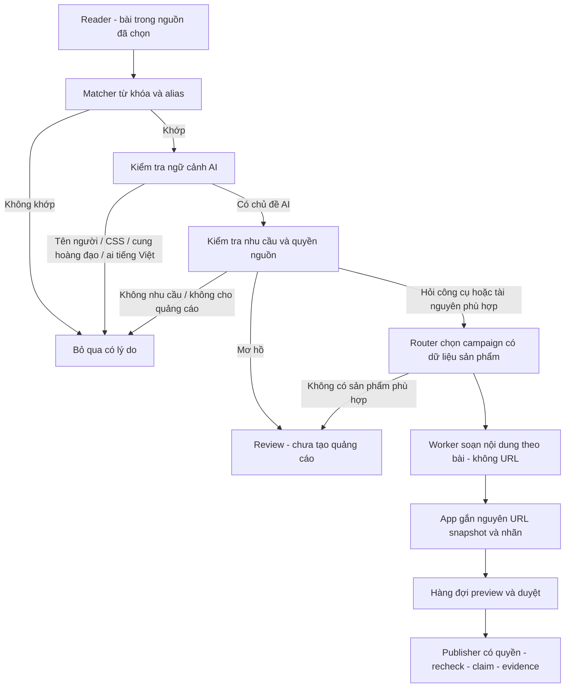

# Discovery theo từ khóa AI

09/10/2026 · Thiết kế bổ sung cho L073/L075, chưa nối vào Facebook runtime. Mục tiêu: tự tìm bài có nhắc chủ đề AI trong nguồn đã chọn, xác định đúng ngữ cảnh, chọn campaign phù hợp và tạo bản thảo bình luận. Không phải nhập permalink từng bài.

## Cấu trúc luồng



Nhắc tên model là tín hiệu tìm bài, không tự tạo quyền gửi quảng cáo. Trong nhóm cho quảng cáo, một bài chia sẻ demo chưa hỏi công cụ không mặc nhiên cần lời mời mua tài khoản. Có thể lưu vào danh sách chủ đề liên quan để owner xem, nhưng không tự soạn lời chào mua rồi gửi.

## Từ điển có thể mở rộng

| Nhóm/entity | Tên/alias ban đầu | Điều kiện tránh khớp sai |
|---|---|---|
| AI / LLM | AI, artificial intelligence, trí tuệ nhân tạo, LLM, mô hình ngôn ngữ | Từ `ai` tiếng Việt không tự khớp; AI viết hoa cũng cần ngữ cảnh công cụ/model |
| Claude | Claude, Claude Code | Claude tên người không đủ; hỏi model/code agent mới liên quan |
| Codex | Codex, OpenAI Codex | Không lấy sách/bộ luật chỉ vì có Codex |
| Antigravity | Antigravity | Cần ngữ cảnh AI/agent/lập trình; vật lý anti-gravity không khớp |
| Gemini | Gemini, Gemini AI | Cung hoàng đạo không khớp |
| Grok | Grok, Grok AI | Từ thường hoặc tên khác không đủ ngữ cảnh |
| Cursor | Cursor, Cursor AI, Cussor | CSS cursor/con trỏ chuột không khớp; Cussor là alias do người dùng cấp |
| ChatGPT | ChatGPT, Chat GPT, Chat-GPT | Nhận nguyên cụm, không khớp từ nằm trong URL hoặc chuỗi mã tùy ý |
| API AI | API, API key, token API | API đơn lẻ là generic; phải có entity AI hoặc LLM/model inference trong ngữ cảnh |
| Mở rộng | DeepSeek, Llama, Qwen, Mistral, Copilot | Chỉ là nhãn nhận diện; bật theo campaign và nguồn sản phẩm đã xác minh |

Alias cấu hình rõ, không bật fuzzy matching mọi từ. Tên mới thêm trong profile, không cần sửa lõi matcher. Không kết luận nhà cung cấp bán mọi model có trong từ điển. Profile mẫu: [keyword-profile.json](examples/keyword-profile.json).

## Matching và ngữ cảnh

Giữ bài gốc để chỉ ra đoạn khớp. Tạo bản phục vụ matching bằng Unicode NFKC, gom khoảng trắng và case-fold tên thương hiệu; mapping về đoạn gốc phải giữ được. Không áp dụng phép biến đổi này lên affiliate URL. Bỏ URL, email, code block khỏi lớp matching mặc định; chúng không tự tạo nhu cầu mua.

Match theo ranh giới Unicode chữ/số, ưu tiên cụm dài (Claude Code trước Claude, Cursor AI trước Cursor), dedupe entity và giữ alias thực khớp. `chair` không khớp AI; `apiculture` không khớp API. `AI` uppercase hoặc tên thương hiệu vẫn cần context, không cộng điểm nhiều lần khi tác giả lặp từ.

Context dùng câu hiện tại và tối đa một câu trước/sau. Các tín hiệu tích cực: model/LLM/chatbot, agent viết code, hỏi gói/quota/tài nguyên, tên công cụ AI khác. Các tín hiệu loại trừ: con trỏ/CSS, cung hoàng đạo, vật lý, tên người không nói về AI. Có cả tích cực và loại trừ hoặc đoạn trích quá ngắn → review. Website/bài đăng không được thay cấu hình, link hoặc quyền dù chứa chỉ dẫn yêu cầu tool làm vậy.

## Quyết định thay vì chỉ chấm điểm

Ba đầu ra của classifier: `skip`, `review`, `draft`. Không có đầu ra `publish`. Quyết định dựa trên cổng bắt buộc; điểm xếp hạng không thể bù thiếu quyền/identity/nội dung phù hợp.

| Điều kiện | Đầu ra |
|---|---|
| Không khớp chủ đề hoặc nghĩa khác | skip |
| Có AI nhưng chỉ demo/tin tức, không hỏi gợi ý/tài nguyên | skip quảng cáo; có thể lưu topic candidate |
| Khớp mơ hồ hoặc không có campaign phù hợp | review |
| Nguồn không cho quảng cáo, đã xử lý, identity thiếu | skip hoặc review identity; không gửi |
| Nguồn có quyền, nhu cầu rõ, sản phẩm đáp ứng và dữ liệu đủ | draft → preview → duyệt |

Ví dụ hợp lệ cho draft: “Mình cần Claude Code cho dự án, có gói nào và điều kiện dùng thế nào?” Chỉ route tới campaign có thông tin gói Claude Code đã xác minh; nếu campaign chỉ là mô tả cửa hàng chung thì review, không hứa cửa hàng có gói đó. Câu “Claude Code làm demo này hay quá” là topic liên quan, chưa đủ nhu cầu quảng cáo.

## Hợp đồng module dự kiến

- `KeywordCatalog`: profile version, entity IDs, aliases, generic/context rules; UI cho sửa/reset/preview, không cho chạy regex tùy ý.
- `KeywordMatcher.match(postText, profile)`: matchedEntities và matchEvidence; không truy cập mạng, không đọc account, không trả URL affiliate.
- `ContextClassifier.classify(candidate, matches)`: AI context/intent/reason codes/evidence; AI lỗi hoặc thiếu evidence → review, không fail-open.
- `CampaignRouter.resolve(entities, intent, campaignVersions)`: campaign phù hợp, lý do và version; nhiều campaign ngang nhau → review, không chèn nhiều URL.
- `DraftQueue.enqueue(...)`: identity/account/scope/profileVersion/campaignVersion/rawUrlSnapshot/dedupe key. Scope/link/approval thay đổi trước gửi phải recheck.
- `Publisher`: giữ contract claim/STOP/uncertain hiện có; chỉ nhận job đã duyệt và quyền adapter đã qua gate.

Đây là ranh giới logic cho các module tương lai, không phải tên file đã được thêm vào runtime. Matcher/context thuộc L073, UI catalog thuộc L075, schema/version phối hợp owner L071/L072. Không sửa model/runner/UI cùng lúc khi chưa nhận ownership.

## Dữ liệu đầu ra mẫu

```json
{
  "candidateId": "fixture-post-01",
  "profileVersion": "1.0",
  "matchedEntities": ["claude"],
  "matchEvidence": [{"alias": "Claude Code", "excerpt": "Mình cần Claude Code cho dự án"}],
  "aiContext": "confirmed",
  "intent": "resource_request",
  "decision": "draft",
  "reasonCodes": ["AI_TOPIC", "RESOURCE_REQUEST", "CAMPAIGN_COMPATIBLE"],
  "campaignId": "fixture-claude-campaign"
}
```

Fixture này giả định campaign đủ điều kiện và scope advertising hợp lệ; classifier không tự xác nhận quyền thực tế. Publisher vẫn cần identity/quyền/approval/evidence riêng.

## UI và nghiệm thu

Trong chiến dịch thêm vùng “Từ khóa & ngữ cảnh”: danh sách chip, alias, thêm từ, ignore terms, test thử đoạn văn. Discovery hiển thị đoạn khớp, tên entity, nhu cầu, campaign được chọn, lý do skip/review và preview comment. Có thể bật/tắt entity theo chiến dịch và thêm lĩnh vực khác bằng profile riêng.

Thống kê riêng `postsRead`, `keywordMatched`, `aiContextConfirmed`, `draftCreated`, `reviewRequired`, `skipped`, `publishedConfirmed`, `uncertain`. Các tập có thể chồng nhau; không cộng thành lượt click. Click/đơn đến từ báo cáo nhà cung cấp.

Nghiệm thu L073: đọc [keyword-cases.json](examples/keyword-cases.json), kiểm tra generic AI/API, Cursor CSS, Gemini hoàng đạo, alias Cussor, demo không hỏi mua, campaign không phù hợp, bài trùng, nguồn không cho quảng cáo, prompt injection, và link nguyên chuỗi. Trước release chạy classifier thật trên fixtures và ghi confusion counts; hiện fixtures là acceptance examples, chưa phải test runtime đã qua. Rollback: profile mới disabled/review-only, không đổi queue/link cũ.
