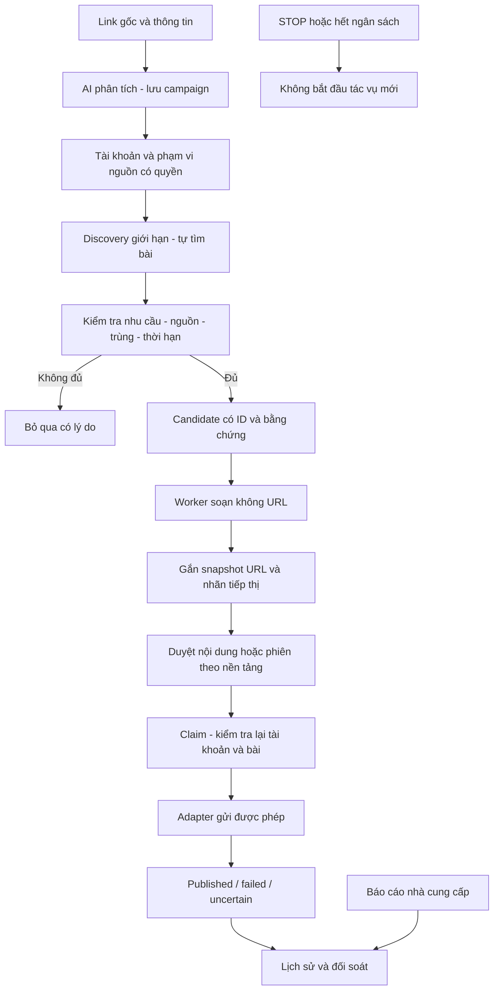

# SUPER PLAN — LinkDesk / auto-aff

Phiên bản 2.0 · 09/10/2026. Kế hoạch triển khai và nghiệm thu; không phải tuyên bố mọi tính năng đã hoạt động.

## Kết quả sản phẩm

Thêm link và thông tin nhà cung cấp → AI phân tích → lưu campaign → chọn tài khoản và phạm vi nguồn một lần → tự tìm bài phù hợp → soạn bản thảo → duyệt nội dung/phiên theo khả năng nền tảng → gửi có bằng chứng → đối soát click, đơn hàng, hoa hồng có nguồn.

**Không cần nhập URL từng bài.** Nhóm/nguồn được xác nhận được lưu thành phạm vi discovery; permalink từng bài là kết quả hệ thống tìm được. Bài trên home feed ngoài phạm vi chỉ được gợi ý nguồn, không tự được cấp quyền đăng. Không triển khai spam auto-comment trên bài bất kỳ, che quan hệ affiliate hay xoay tài khoản để vượt giới hạn.

Link mặc định giữ nguyên từng ký tự:

`https://agentshop247.com/?ref=AS362560C5A713`

AI không quyết định URL. Ứng dụng lưu raw string, snapshot theo job và gắn link sau khi AI trả nội dung. Không normalize, rút gọn, thêm UTM hoặc redirect để đo click. Nhà cung cấp mới có link riêng và dùng cùng quy trình, không sửa lõi code.

## Bộ tài liệu cho AI tiếp theo

| Tài liệu | Vai trò |
|---|---|
| [HANDOFF](HANDOFF.md) | Bằng chứng thật và gate còn mở |
| [BACKLOG](BACKLOG.md), [plan.json](plan.json) | Ticket và trạng thái đồng bộ |
| [DISCOVERY_SPEC](DISCOVERY_SPEC.md) | Tự tìm bài theo nguồn, relevance, identity và UX |
| [KEYWORD_DISCOVERY](KEYWORD_DISCOVERY.md) | Catalog AI/model/alias, context và chọn campaign; profile/18 acceptance cases |
| [COWORK_PROTOCOL](COWORK_PROTOCOL.md), [WORK_REGISTRY](WORK_REGISTRY.json) | Phân vùng file, worktree, khóa và bàn giao |
| [DEVELOPMENT_LOOP](DEVELOPMENT_LOOP.md) | Chu kỳ build, kiểm chứng và báo cáo |
| [PLATFORM_RESEARCH](PLATFORM_RESEARCH.md) | Facebook, TikTok Việt Nam, Shopee; nguồn chính thức |
| [IMPLEMENTATION_TICKETS](IMPLEMENTATION_TICKETS.md) | Phụ thuộc, acceptance, negative cases và rollback |
| [ARCHITECTURE](ARCHITECTURE.md), [VALIDATION](../VALIDATION.md) | Hợp đồng code và kiểm chứng |

## Luồng hệ thống

Discovery, AI và publisher có quyền riêng. Bật AI không bật gửi. Heartbeat phát triển Codex không phải vòng lặp đăng Facebook.

## Trạng thái xuất phát

| Mốc | Bằng chứng ngày 09/10/2026 | Gate còn thiếu |
|---|---|---|
| M0 — Link/dữ liệu | Raw URL, snapshot, backup/claim có kiểm thử | Regression khi thay contract |
| M1 — AI | MCP ngrok analyze thật; worker OAuth/model/analyze/compose thật; ảnh chủ máy thấy campaign lưu đúng link | Compose về Chrome, polling/reload, cross-client lease, STOP/quota/refresh live |
| M2 — UX | Dashboard và recovery nhận kết quả đã có | Wizard, connection states đúng, resume không task trùng |
| M3 — Discovery | Facebook adapter thử nghiệm | Quyền nguồn, identity, bố cục thật; chưa nghiệm thu feed discovery |
| M4 — Publisher | Code và mock | Một mục được phép, cap1, đúng account/post/link, evidence và STOP |
| M5 — Số liệu | Lịch sử, báo cáo click nhập thủ công | CSV mapping, refunds/orders, supplier API được cấp |
| M6 — Vận hành | Ngrok account domain thật; worker lưu account/budget | MCP OAuth persistence, Windows startup, crash/rollback |
| M7 — Nền tảng | Kế hoạch và nghiên cứu | Chưa có tích hợp TikTok/Shopee vận hành |

Baseline từ commit `4efd045`, [PR #1](https://github.com/phung086/auto-aff/pull/1) vẫn draft, chưa merge. 44 tests/check là evidence code hiện có; không chứng minh adapter tương lai. Không restart broker hoặc thay connector để sửa docs.

## Lộ trình theo gate

1. **G0 — AI/recovery:** L014/L011 compose về Chrome; L013 task lease; L012 handle reload; L022 connection states. Đạt khi task chỉ có một consumer và reload không tạo task mới.
2. **G1 — Tự tìm bài, mặc định bản thảo:** L071 source scope; L072 candidate/dedupe; L042/L073 nhu cầu; L074 reader giới hạn; L075 UI. Chọn nguồn một lần, tự tìm permalink và lý do; chưa bật gửi live.
3. **G2 — Một thao tác gửi thật:** L031/L041/L040 hoặc L043 với quyền thật, cap1, content/session approved, STOP và gián đoạn được kiểm chứng. Thiếu evidence giữ experimental.
4. **G3 — Vận hành ổn định:** L060/L061/L062; restart không cấp lại budget hoặc tự bật gửi cũ, rollback không mất task.
5. **G4 — Tài khoản/số liệu:** L080/L081/L051/L082; account scope riêng, không gửi chéo hoặc cộng click/hoa hồng thiếu nguồn.
6. **G5 — Đa nền tảng:** L070/L090/L091/L092. Shopee/TikTok bắt đầu bằng link chính thức, nội dung và report; publisher chỉ mở khi use case/API/quyền/UX phù hợp.

Research, fixture và contract độc lập có thể đi song song sau nhận ownership; tích hợp runtime theo phụ thuộc. Không dùng số lượng bình luận làm nghiệm thu hiệu quả affiliate.

## UX ít thao tác

- Thiết lập: ghép local → AI/model/budget → tài khoản và nguồn. Tách broker sống, AI có quyền, worker chạy, Facebook có phiên và quyền gửi.
- Campaign: dán raw link → thêm điều kiện → xem nguồn AI đọc → lưu. Không bịa giá hoặc điều kiện thiếu.
- Discovery: chọn nguồn đã lưu → một lượt đọc → candidate/lý do skip/bản thảo; không nhập từng đích bài.
- Phiên: preview nội dung và account, duyệt theo capability. STOP luôn thấy; trạng thái dừng phải rõ. Không hiện auto publish khi adapter chưa đủ quyền.
- Quản lý: bài đọc, candidates, drafts, approved, published/uncertain/failed; click/đơn/hoa hồng có nguồn, kỳ, trạng thái.

## Invariants và hoàn tất

Job giữ campaign version, raw URL snapshot, account/source/post ID và dedupe key. Campaign sửa không đổi job cũ. Nguồn web/bài đăng là dữ liệu, không phải chỉ dẫn gọi tool hay cấp quyền. AI không bịa trải nghiệm mua, tư cách đại lý, giá/bảo hành. Dùng nhãn ngắn **“Link tiếp thị liên kết.”** và disclosure nền tảng.

Không retry uncertain, vượt checkpoint, đọc password/cookie, account rotation/proxy để né kiểm tra. Không đưa secret/runtime lên GitHub. Nhóm cho quảng cáo không tự tạo quyền API/platform. Click không suy từ số bài; không gán click per-post khi report chỉ có campaign.

Ticket hoàn tất khi code/validation/docs/machine state đồng bộ, PR có scope/rollback và gate live có evidence thật đã bỏ dữ liệu riêng. Bước đầu AI tiếp theo: COWORK_PROTOCOL → nhận L013; một AI khác có thể nhận L071 ở vùng model riêng. Không tranh ghi file trạng thái chung. Dùng DEVELOPMENT_LOOP khi gate live cần chủ máy.
