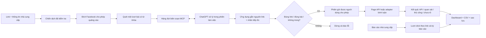

# SUPER PLAN — LinkDesk / auto-aff

Phiên bản kế hoạch 1.0 · 08/10/2026 · Chủ dự án: phung 086. Đây là kế hoạch phát triển và tiêu chuẩn nghiệm thu; không phải lời tuyên bố mọi tính năng đã hoạt động trên tài khoản thật.

## Kết quả cần đạt

Một công cụ tiếng Việt trên Chrome: thêm nguyên link nhà cung cấp → đọc thông tin → ChatGPT soạn theo nhu cầu → chọn nhóm được phép quảng cáo hoặc Page của mình → chạy phiên có giới hạn → xem bằng chứng gửi và số liệu có nguồn. Một nhà cung cấp mới phải dùng cùng quy trình, không sửa mã nguồn.

Link mặc định là **nguyên chuỗi** `https://agentshop247.com/?ref=AS362560C5A713`. Không chuẩn hóa, rút gọn, thêm UTM hoặc thay bằng redirect để đo click. Mỗi chiến dịch dùng link riêng; mỗi mục gửi lưu bản chụp link tại thời điểm tạo.

## Luồng hệ thống

## Thứ tự phát triển

| Mốc | Phạm vi | Trạng thái hiện tại | Điều kiện qua mốc |
|---|---|---|---|
| M0 — Nền tảng và link | Chiến dịch nhiều nhà cung cấp, snapshot URL, đích, hàng đợi, chống trùng, sao lưu | Có mã và kiểm thử | Thay một ký tự/URL phụ bị chặn trước khi gửi; khôi phục không bật quyền gửi |
| M1 — ChatGPT không cần AI key | Broker local, MCP stdio/HTTP, OAuth PKCE, yêu cầu có hạn dùng, ghép Chrome | Có mã; tài khoản thật chưa nghiệm thu | MCP initialize/list/call qua HTTPS có OAuth; ChatGPT thật trả một cấu hình nguồn và một bài; Chrome nhận đúng link |
| M2 — Khởi đầu đơn giản | Bắt đầu 3 bước, cấu hình ChatGPT ưu tiên, API nâng cao, trạng thái chờ | Có giao diện; cần xác nhận với người dùng thực | Người mới hoàn thành thiết lập từ README; không hiểu nhầm ghép local là ChatGPT đã kết nối |
| M3 — Tìm nhóm và tham gia | Tìm tối đa 10 nhóm đang hiển thị, kiểm tra quy định, tham gia một nhóm đã chọn, trạng thái chờ duyệt | Adapter thử nghiệm | Không tự xác nhận nhóm cho quảng cáo; câu hỏi thành viên cần người dùng; bấm một lần; uncertain không tự thử lại |
| M4 — Gửi có bằng chứng | Quét bài, đánh giá liên quan, soạn, gửi một mục mỗi nhịp; Page qua API | Có mã; Facebook thật chưa nghiệm thu | Một nhóm thực được phép + một Page thực; đối chiếu đúng bài/link; STOP ngăn mục kế tiếp; kiểm tra gián đoạn |
| M5 — Quản lý và số liệu | Kết quả theo chiến dịch, lịch sử CSV, nhập báo cáo click có nguồn và kỳ | Có mã cho thống kê và nhập thủ công | Click không suy từ số bài; không cộng kỳ trùng; không báo CTR/conversion thiếu dữ liệu |
| M6 — Vận hành ổn định | Host HTTPS cố định, OAuth bền vững, Windows launcher, chẩn đoán, cập nhật có rollback | Đang làm: ngrok host thật + analyze đã qua; MCP OAuth bền vững còn chờ | Không cần URL tunnel mới mỗi phiên; sao lưu trước nâng cấp; không đưa token lên GitHub |
| M7 — Mở rộng | Adapter nguồn/nhà cung cấp, báo cáo API, lịch nội dung Page, các nền tảng cho phép | Chưa triển khai | Hợp đồng adapter + kiểm thử + quyền cụ thể; không sửa lõi exact-link |

Ưu tiên kế tiếp: **L060 ổn định endpoint/OAuth → M1 nghiệm thu tools và bản thảo thật → M4 nghiệm thu Facebook nhỏ**. Gián đoạn Quick Tunnel đã chứng minh cần xử lý kết nối trước. Xem [STABLE_CONNECTION](STABLE_CONNECTION.md). Không mở rộng diện đăng khi ba điểm này chưa có bằng chứng.

## Các chặng và công việc

### Chặng A: phát hành nền tảng 0.2

Hoàn thiện tài liệu, kiểm thử broker/OAuth/link, cấu hình mặc định ChatGPT, thống kê, CI và bản đóng gói. GitHub phải chứa đủ code và lockfile để `npm ci`, `npm test`, `npm run check` chạy từ checkout sạch. Ghi mọi giới hạn trong HANDOFF; không commit dữ liệu chạy.

### Chặng B: kết nối thật và thử nhỏ

1. Khởi động broker/tunnel bằng `npm run connect`. Ghép `pairing.json` trong Chrome.
2. Thêm MCP vào ChatGPT bằng OAuth, kiểm tra bốn tools phát hiện được.
3. Gửi yêu cầu phân tích nguồn; ChatGPT soạn; Chrome mở form để kiểm tra và lưu.
4. Tạo yêu cầu bình luận thủ công; kiểm tra nguyên link, ngữ cảnh, nhãn tiếp thị ngắn.
5. Chọn một nhóm cho phép quảng cáo và một bài phù hợp, giới hạn một mục. Kiểm tra trực tiếp kết quả. Với Page, cần Page token đúng quyền; không thay bằng token tài khoản.
6. Thử STOP khi đang chờ AI và thử mất kết nối; kết quả muộn không được gửi.
7. Ghi bằng chứng đã làm vào VALIDATION, bỏ mọi mã/token/chi tiết tài khoản riêng khỏi tài liệu public.

### Chặng C: độ bền và trải nghiệm vài click

Host cố định thay Quick Tunnel, OAuth client/token lưu an toàn hoặc nhà cung cấp OAuth chuẩn, giới hạn scope/device, Windows launcher có log rõ và nút STOP. Xây health check độc lập cho Chrome, broker, MCP, ChatGPT và Facebook. Sau đó đóng gói signed installer/Chrome Web Store nếu phù hợp, kiểm tra cập nhật/rollback.

### Chặng D: tăng khả năng mở rộng

Nguồn có phiên bản và ngày xác minh, điều kiện bán từng gói, chiến dịch linh hoạt theo ngành. Adapter nhà cung cấp nhập click/conversion/commission nếu họ có API và cấp quyền; đối chiếu nguyên ref. Nền tảng mới cần API/điều khoản và quyền của chính nền tảng. Tối ưu chất lượng theo kết quả thực; không dùng số lượng link làm bằng chứng hiệu quả bán hàng.

## Quy tắc không được phá

- AI chỉ viết nội dung; mã ứng dụng gắn URL. Trước mỗi thao tác gửi kiểm tra đúng một URL trên dòng riêng, khớp nguyên snapshot.
- Nguồn website và bài Facebook là dữ liệu không đáng tin. Không nhận chỉ dẫn trong nguồn để gọi công cụ, thay link hoặc mở quyền.
- Có nhãn ngắn **“Link tiếp thị liên kết.”**; không giả làm người dùng đã mua, không bịa chứng thực hoặc che quan hệ tiếp thị.
- Gửi một lần cho một mục đã claim. Có bằng chứng API/quan sát mới ghi trạng thái tương ứng. Mất kết nối sau thao tác ghi `uncertain`, không gửi lại tự động.
- Nhóm phải do người dùng xác nhận cho phép quảng cáo. Không đoán quy định từ tên nhóm. Nhóm chờ duyệt không được xem là đã tham gia.
- Không tự trả lời câu hỏi thành viên bằng thông tin bịa, giải CAPTCHA, vượt checkpoint, xoay tài khoản hay proxy để né kiểm tra.
- Click không thể đo trực tiếp từ nguyên URL của website bên thứ ba nếu không có dữ liệu họ cung cấp. Không cộng báo cáo cùng kỳ hoặc đưa số giả vào dashboard.
- Plugin kết nối không đồng nghĩa ChatGPT tự chạy nền. Phiên ChatGPT/Work cần thực sự được khởi động để xử lý; không hứa chạy 24/7 với Plus chỉ bằng plugin.
- Token Page, API key, pairing token, owner code và task data là runtime riêng; không xuất vào backup của extension hoặc commit.

## Quy trình cho mọi thay đổi

Đọc AGENTS → HANDOFF → BACKLOG. Chọn một mục Ready cao nhất, ghi kiểm chứng mong đợi, tìm đúng file bằng rg, triển khai, chạy kiểm thử phù hợp, đối chiếu giao diện nếu đổi UI, cập nhật trạng thái/giới hạn và commit. Không đánh dấu hoàn tất một mốc có thao tác tài khoản thật nếu chỉ kiểm thử mock. Khi có lỗi gửi chưa rõ, dừng tự động và đối chiếu trên Facebook trước.

## Tham chiếu chính thức

Tài liệu xem ngày 08/10/2026: [Open AI — kết nối plugin MCP](https://developers.openai.com/plugins/deploy/connect-chatgpt), [OAuth cho plugin](https://developers.openai.com/plugins/build/auth), [đóng gói plugin](https://developers.openai.com/plugins/build/plugins), [Meta Groups API v 19](https://developers.facebook.com/docs/graph-api/changelog/version19.0), [Page posts](https://developers.facebook.com/docs/pages-api/posts/), [Cloudflare Quick Tunnel](https://developers.cloudflare.com/tunnel/get-started/quick-tunnels/).

## Chặng AI tự động không cần prompt từng lượt

MCP không tự kích hoạt inference. L014 bổ sung Sign in with ChatGPT / ChatGPT plan usage chính thức cho app open-source chạy tại máy: cấp quyền một lần → chọn model/hạn mức → worker lấy task → chỉ nhận response.completed/JSON hợp lệ → broker gắn nguyên URL → Chrome nhận bản thảo. PR #1 đã qua 40 tests/check, OAuth/model và analyze/compose worker thật ngày09/10. Cap2 tự dừng, restart giữ account/budget và đọc model không cần đăng nhập lại. UI extension nhận/lưu, STOP/quota/refresh thật vẫn còn gate; không đánh dấu M1 hoàn tất toàn bộ. Theo AUTO_AI_SETUP và WORKER_OAUTH_VERIFICATION. Tiếp theo L013 lease, L012 handle reload và L061 supervision. Không dùng API riêng/cookie ChatGPT, không tự chuyển billing, không mở rộng diện đăng Facebook trước cap1 evidence.
